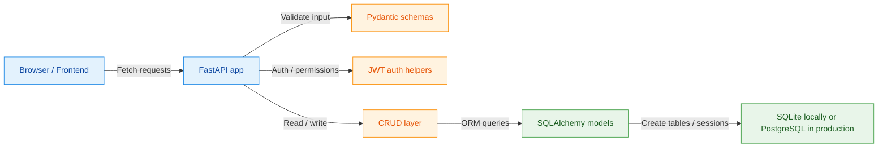
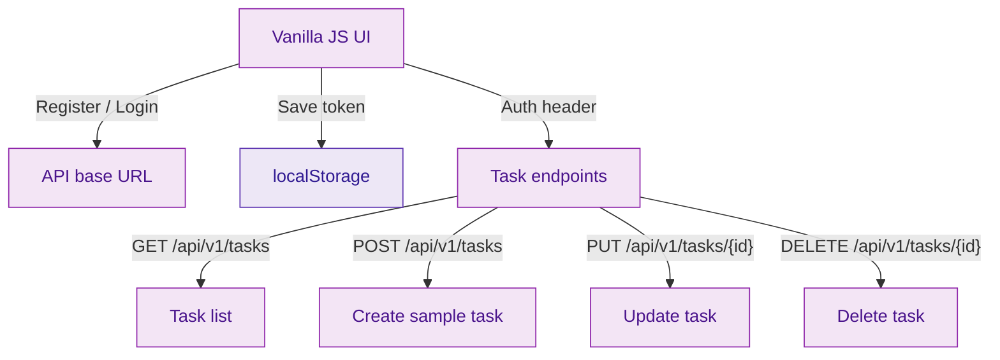
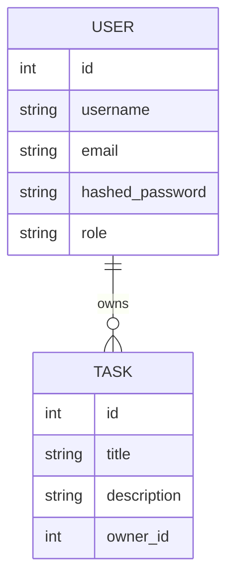

# FastAPI CRUD + Vanilla JS

A small full-stack demo with FastAPI, SQLAlchemy, JWT auth, role-based access, and a vanilla JavaScript frontend.

## Live Links

- GitHub repository: [Manny2706/Fast-Api-Crud](https://github.com/Manny2706/Fast-Api-Crud)
- Live API: [https://fast-api-crud-balg.onrender.com](https://fast-api-crud-balg.onrender.com)
- API docs: [https://fast-api-crud-balg.onrender.com/docs](https://fast-api-crud-balg.onrender.com/docs)

## Features

- User registration and login
- JWT authentication
- Role-based access control
- Task CRUD
- SQLite for local development
- PostgreSQL-ready for production

## Project Structure

```text
fastapi-vanillajs/
├── fastapi_app/
│   ├── auth.py
│   ├── crud.py
│   ├── database.py
│   ├── main.py
│   ├── models.py
│   └── schemas.py
├── frontend/
│   ├── env-config.js
│   └── index.html
├── tests/
├── requirements.txt
├── render.yaml
├── vercel.json
└── README.md
```

## Mermaid Diagrams

### Backend + Database Flow



### Frontend Interaction Flow



### Database ER Diagram



## Local Setup

### 1) Create and activate the virtual environment

```powershell
python -m venv env
.\env\Scripts\Activate.ps1
```

### 2) Install dependencies

```powershell
pip install -r requirements.txt
```

### 3) Run the backend

```powershell
uvicorn fastapi_app.main:app --reload --host 127.0.0.1 --port 8000
```

Open the API docs here:

- [http://127.0.0.1:8000/docs](http://127.0.0.1:8000/docs)

### 4) Run the frontend

Serve the `frontend` folder with any static server. Example:

```powershell
cd frontend
python -m http.server 5173 --bind 127.0.0.1
```

Then open:

- [http://127.0.0.1:5173](http://127.0.0.1:5173)

## Environment Variables

- `SECRET_KEY`: JWT secret used by the backend
- `DATABASE_URL`: database connection string

Example local `.env`:

```dotenv
SECRET_KEY=your-secret-key
DATABASE_URL=sqlite:///./db.sqlite3
```

## Production Notes

- The backend is deployed on Render.
- The frontend is best deployed separately on Vercel or another static host.
- Update `frontend/env-config.js` or inject `window.__API_BASE` at build time so the frontend points to the deployed API.
- For production, use PostgreSQL instead of SQLite.

## Deployment Commands

Push the current branch to GitHub:

```powershell
cd "c:\Users\mayan\Desktop\New folder\fastapi-vanillajs"
git push origin main
```

## API Endpoints

- `POST /api/v1/auth/register`
- `POST /api/v1/auth/login`
- `GET /api/v1/users/me`
- `GET /api/v1/users`
- `POST /api/v1/users/{user_id}/promote`
- `GET /api/v1/tasks`
- `POST /api/v1/tasks`
- `GET /api/v1/tasks/{task_id}`
- `PUT /api/v1/tasks/{task_id}`
- `DELETE /api/v1/tasks/{task_id}`

## License

This project is provided as-is for learning and demo purposes.
